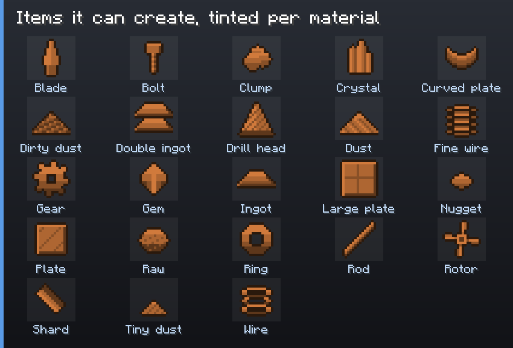

# Created Items

Some materials lack a form the pack needs: no netherite rod, no tin gear. Material Nexus can create
it as a new item.



## Creating one

In **Materials**, a form the material does not have is shown as **Absent**. When Material Nexus can
create it, the row has **Create item**. Click it (it becomes *Creation pending*), then Preview and
Apply, then **restart the game**: items can only be registered at startup.

The new item:

- has the id `materialnexus:<material>_<form>` (`materialnexus:netherite_rod`);
- is named from the material and the form ("Netherite Rod");
- is drawn from the form's template, tinted with the material's colour;
- is put in its convention tag (`forge:rods/netherite`), so Material Nexus and every other mod see it as
  that material's form;
- appears in the creative *Ingredients* tab.

It has **no recipe** by itself: add one with a [Process Rule](Process-Rules) (an ingot in the metal
press gives two rods...) or your own datapack.

## Forms that can be created

23 item forms have a template: blade, bolt, clump, crystal, curved plate, dirty dust, double ingot,
drill head, dust, fine wire, gear, gem, ingot, large plate, nugget, plate, raw, ring, rod, rotor,
shard, tiny dust, wire. Blocks and ores cannot be created (they would need a block, not an item).

A material with a gem (coal, quartz, diamond) gets no ingot, double ingot, wire or raw ore: those
are metal forms. A material with an ingot gets no gem.

## In the files

`config/materialnexus/items.json`:

```json
{
  "items": [
    { "material": "netherite", "form": "rod", "color_from": "minecraft:netherite_ingot" },
    { "material": "tin", "form": "gear", "color": "#B8C4D0" }
  ]
}
```

`color_from` takes the average colour of that item's texture; `color` sets it directly. The file is
read at startup only.

## Your own texture or model

The tinted template is only the default. Two ways to draw a created item your way:

- **A texture in `items.json`**: `"texture": "mypack:item/netherite_rod"` on the entry. The item is
  drawn with that texture (`assets/mypack/textures/item/netherite_rod.png`, from your resource pack
  or a mod), as it is, without tint.
- **A model in a resource pack**: `assets/materialnexus/models/item/<material>_<form>.json`
  (`netherite_rod.json`), in a resource pack loaded above "Material Nexus created items". Any model
  works; it is not tinted either.

```json
{ "material": "netherite", "form": "rod", "texture": "mypack:item/netherite_rod" }
```

Only the template, on its own layer, is ever tinted: your texture or model keeps its colours.

## Things to know

- **Restart** after creating: until then, the item is listed as pending creation.
- **Revert does not remove it**: the registry cannot change while the game runs. Remove its entry
  from `items.json` and restart.
- **Removing an entry deletes the item** from every world that has some.
- **On a server, every client needs the same `items.json`**: ship it with the pack, or players
  cannot join.
- A resource pack can also replace a template for every material at once:
  `assets/materialnexus/textures/item/template/<form>.png` (grayscale, tinted by the game).
