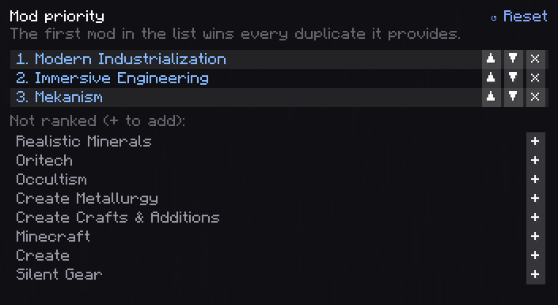

# Getting Started

From a pack with duplicates to a unified pack, in one sitting.

## 1. Install

Put Material Nexus in the `mods` folder of the pack, on the client you build the pack with. JEI or
EMI are optional; with one of them, unified alternatives disappear from the item list.

Open a **singleplayer** world (or one opened to LAN). Deciding is done there: on a dedicated
server the screen is read-only (see [Modpacks and Multiplayer](Modpacks-and-Multiplayer)).

## 2. Open the screen

Run `/materials`, or right click with the **Nexus Terminal** (creative *Tools & Utilities* tab, shown when "Operator Items" is on). You need operator
rights (permission level 2); in singleplayer, cheats must be allowed.

The **Home** view counts what was found:

- **Forms to decide**: a material form with items from several mods and no decision yet.
- **Forms unified**: a form where one item is kept, by your choice or by the mod priority.
- **Items set aside**: items that share a tag with others but are something else (a variant,
  another material); they are never unified unless you pick them.

## 3. Decide

Three ways, mix them freely:

- **Triage what is to decide**: every open form, one after the other, the candidates in big tiles.
  Press **1-9** to keep that item and move on; **S** or **→** to skip, **B** or **←** to go back,
  **Shift + number** to mark an item as "not the same", **Esc** to leave.
  
- **Mod priority** (right of Home): click **+** on mods in the order you trust them. The first mod
  in the list wins every duplicate you have not decided yourself.
  
- **Unify all suggestions**: accepts every suggestion at once, as your choices. Fine for a first
  pass; read the preview.

Or open **Materials**, pick one, and click the item to keep on each row. See
[Choosing Items](Choosing-Items).

Every decision is a **pending change**: the bottom bar counts them, and nothing is written yet.

## 4. Preview and apply

Click **Preview and apply** at the bottom. The right panel lists every change, grouped: your
choices, tags cleaned, items converted, recipes rewritten or disabled, recipes not handled yet.
Open a group to read its lines.

Click **Apply**. Material Nexus writes its generated datapack, reloads the data, and reopens the
screen on the new state. Recipes now give the kept items, JEI or EMI hide the others, and
alternatives in the world turn into the kept item as players pick them up or open containers.

## 5. Undo, if needed

- A pending change: **review / discard** in the bottom bar, then **×** on the line.
- A saved choice: **↺** on its row, or **Back to default** for a whole material.
- The whole apply: **Revert last apply** on Home.
- An older state: **↺** next to a line of the **History** on Home.

See [Applying Changes](Applying-Changes).

## 6. Ship it

Everything you decided is in `config/materialnexus/`. Ship that folder with the pack. See
[Modpacks and Multiplayer](Modpacks-and-Multiplayer).
