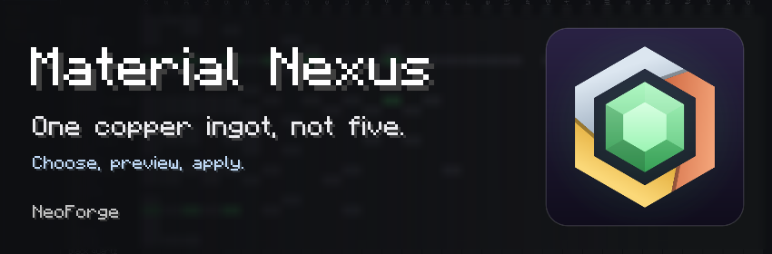

# Material Nexus

A modpack ends up with the same material made by every mod: five copper ingots, three tin plates,
recipes that each want a different one. Material Nexus finds every one of them, lets you decide
which item each material keeps, and then makes the pack agree: tags, recipes, the items already in
the world, and the recipe viewer. Nothing changes until you have read the preview and pressed Apply.

**Forge** · MIT · for modpack makers

[GitHub](https://github.com/DrimoZ/MaterialNexus) ·
[Report a bug](https://github.com/DrimoZ/MaterialNexus/issues)

## What it does

- **Finds every material form** in the pack: from the convention tags (`forge:ingots/copper`,
  `forge:plates/tin`...) and from item names for the forms mods leave untagged.
- **Tells duplicates from variants**: two copper ingots from two mods are duplicates; a yellow
  amethyst tagged as amethyst is a variant, set aside and left alone.
- **Lets you choose** the item each material keeps, form by form, by triage, or by ranking mods.
- **Shows every change first**, then writes one generated datapack: alternatives leave the tags,
  recipes are rewritten to the kept item, items in the world are converted when the game touches
  them, JEI and EMI hide the alternatives.
- **Fills the gaps on request**: machine recipes for every material from one rule, and new items
  for forms a material lacks.
- **Is always reversible**: discard, back to default, revert, restore an earlier state.

## Using it

- **[Getting Started](Getting-Started)**: from installing to the first Apply, in ten minutes
- **[The Screen](The-Screen)**: every view, button and key
- **[Choosing Items](Choosing-Items)**: suggestions, priorities, variants, and why an item is kept
- **[Applying Changes](Applying-Changes)**: what Preview lists, what Apply writes, and how to undo
- **[Process Rules](Process-Rules)**: how a form is made, for every material at once
- **[Created Items](Created-Items)**: the forms a material lacks

## Running a pack

- **[Configuration Files](Configuration-Files)**: everything in `config/materialnexus/`
- **[Modpacks and Multiplayer](Modpacks-and-Multiplayer)**: shipping your choices
- **[Commands and Permissions](Commands-and-Permissions)**

## Extending it

- **[Datapack Guide](Datapack-Guide)**: forms, recipe formats, process templates, presets, materials
- **[Compatibility](Compatibility)**: JEI, EMI, Almost Unified, KubeJS, and the mods whose recipes it rewrites

## Help

- **[FAQ](FAQ)** · **[Troubleshooting](Troubleshooting)**
