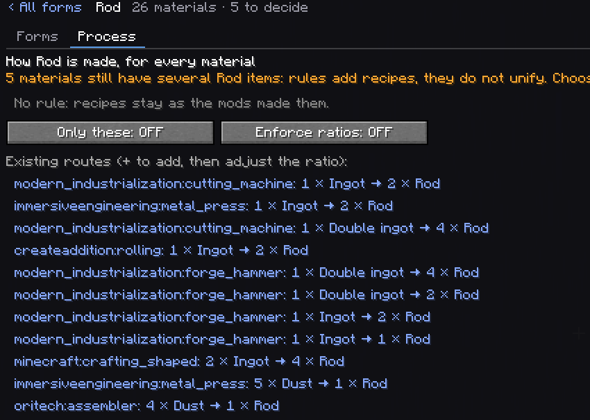

# Process Rules

Unifying makes every mod agree on which copper rod exists. A process rule decides how a copper rod
is **made**: by which machines, from which form, at what ratio, for every material at once.



## Editing a rule

Open **Forms**, click a form's name, then the **Process** tab.

- **Existing routes** lists what the pack's recipes already do for that form, for any material:
  `immersiveengineering:metal_press: 1 × Ingot → 2 × Rod`. **+** adds one to the rule; adjust its
  ratio there.
- **Only these** (`exclusive`): recipes making this form in any other way are disabled.
- **Enforce ratios** (`enforce_ratio`): a recipe of a route's machine with another ratio is
  replaced by one with the rule's ratio. Without it, only missing routes are added.
- A warning lists the materials that still have several items for the form: a rule adds recipes,
  it does not unify. Choose the kept item first.

The rule is a pending change like any other; Preview lists every recipe it generates or disables.

## How the recipes are written

For each material having the form and its input form, each route of the rule:

1. **By example**: Material Nexus looks for a recipe of that machine that already makes this form
   from that input for another material (the material's own recipe first when replacing it). It
   copies it and swaps every reference to that material: tags for tags, items for the kept item,
   conditions included. Then it sets the counts.
2. **By template**: when no recipe can be copied (or the template says `prefer`), a process
   template for that machine is filled in ([Datapack Guide](Datapack-Guide#process-templates)).
3. **Checked**: the written recipe is read back. If the counts are not exactly the rule's ratio (a
   shaped pattern, a count stored somewhere unknown), the next example is tried; with none left, the
   route is listed as unsupported. Then the game must decode it, or it is listed as invalid and not
   written.

Nothing is guessed: a route that cannot be written exactly is shown, not approximated.

Generated recipes have ids like `materialnexus:process/rod/copper/ingot/1/2/immersiveengineering/metal_press`.

## In the files

In `global.json`, per form, for every material:

```json
"processes": {
  "rod": {
    "routes": [
      { "machine": "immersiveengineering:metal_press", "input": "ingot", "in": 1, "out": 2 },
      { "machine": "minecraft:crafting_shaped", "input": "ingot", "in": 2, "out": 4 }
    ],
    "exclusive": true,
    "enforce_ratio": true
  }
}
```

`in` and `out` are 1 to 64. A material file can override the rule for one of its forms with
`"forms": { "rod": { "process": { ... } } }`; `"routes": []` switches the rule off for that material.

## Machines with templates

Shipped templates (used when there is nothing to copy): vanilla shaped and shapeless crafting,
smelting, blasting, stonecutting; Create pressing, cutting, milling, crushing, compacting; Create
Crafts & Additions rolling; Create Metallurgy grinding; Immersive Engineering metal press and
crusher; Modern Industrialization compressor, macerator, wiremill, cutting machine, packer, forge
hammer; Mekanism crushing and enriching; Oritech pulverizer, grinder and assembler. Any other
machine works by example as soon as the pack has one recipe of it for that form.
