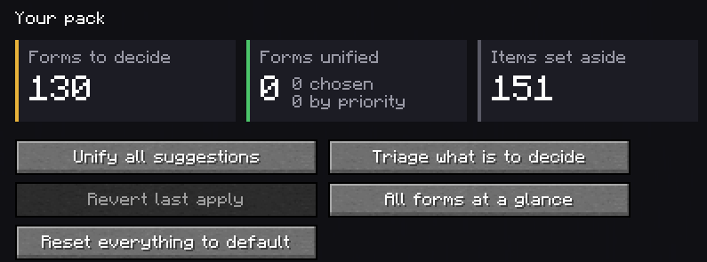
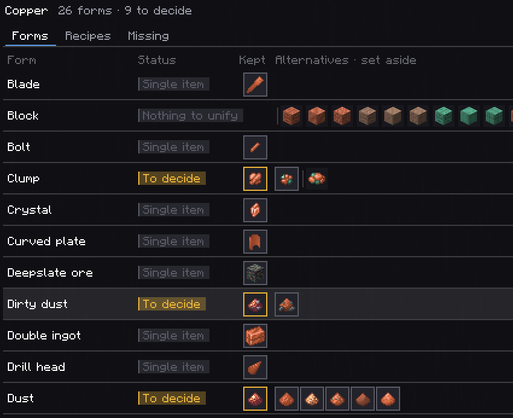
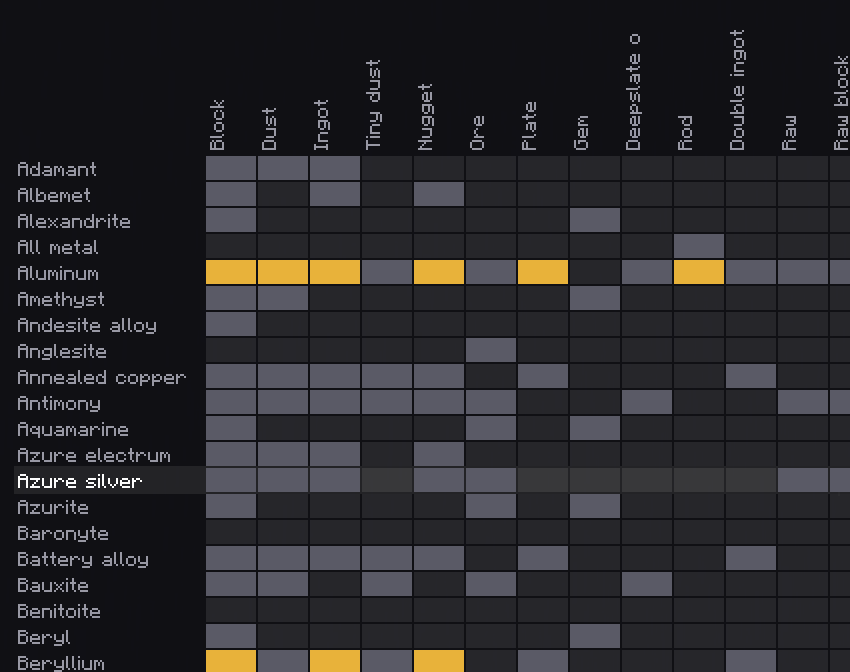
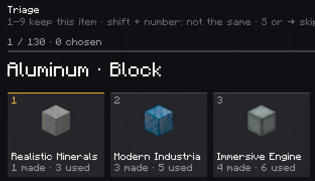
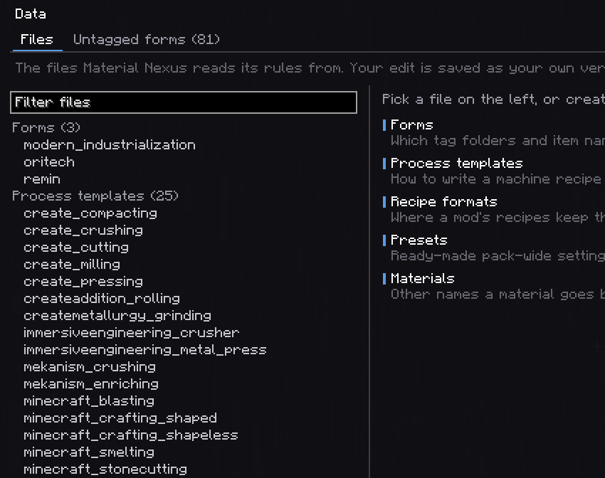
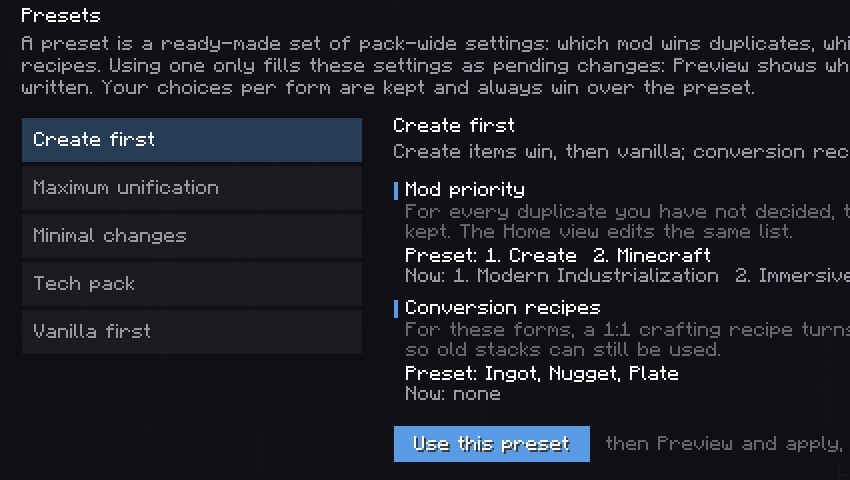
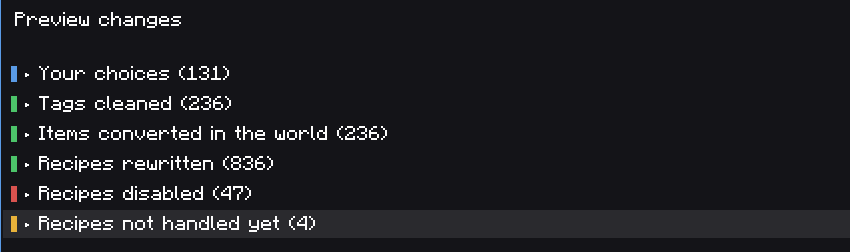
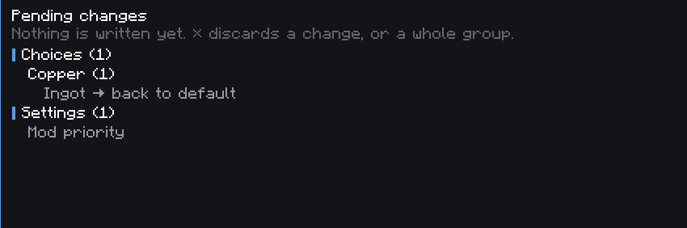

# The Screen

`/materials` (or the Nexus Terminal) opens one screen. A rail on the left switches views; the top
bar counts the pack; the bottom bar holds what is pending.

## The frame

- **Top bar**: *to decide*, *unified* (split into *chosen* by you and decided *by priority*) and
  *set aside*, for the whole pack. The search box finds a material by name from any view.
- **Left rail**: Home, Materials, Forms, Data, Presets. On a dedicated server, Data and Presets are
  hidden and the screen is read-only.
- **Bottom bar**: the number of pending changes by kind (choices, process rules, items to create,
  data edits, settings). Click it (**review / discard**) to list them; **Discard all** drops them;
  **Preview and apply** opens the preview.

Side panels (the preview, the pending list) open on the right; **Esc** closes them.

## Home

- Three cards: forms to decide, forms unified (chosen / by priority), items set aside.
- **Unify all suggestions**: every current suggestion becomes your choice (pending).
- **Triage what is to decide**: see [Triage](#triage).
- **Revert last apply**: puts back the settings as they were before the last Apply, at once.
- **All forms at a glance**: the grid of the Forms view.
- **Reset everything to default**: every saved choice, "not the same" mark, conversion recipe and
  process rule goes back to default, as pending changes. The mod priority is kept; it has its own
  **↺ Reset**.
- **History**: the last applies, reverts and restores. **↺** on an older line restores the settings
  as they were right after it (after a confirmation).
- **Mod priority**, on the right: ranked mods with **▲ ▼ ×**, other mods with **+**. See
  [Choosing Items](Choosing-Items#mod-priority).

## Materials

On the left, every material, filtered by **All / To decide / Unified**; an orange number is how many
of its forms are to decide. On the right, the selected material, with three tabs.

**Forms**: one row per form.

| Column | |
|---|---|
| Status | *To decide*, *Unified*, *Single item*, *Nothing to unify*, *Pending*, *Reset*, *Absent* |
| Kept | the item kept (or that would be): framed in the status colour |
| Alternatives · set aside | the other items; after the separator, those set aside, greyed |
| Recipes › | opens the Recipes tab on that form |

- **Click** an item to keep it (pending). Click the pending one again to cancel.
- **Right click** an item to mark it **not the same** as the others (a red cross); again to unmark.
- **Hover** an item: its name, id, mod, how many recipes make and use it, and why it is kept or set
  aside.
- **↺** at the end of a row with a saved choice: back to default (pending).
- An **Absent** row has **Create item** when Material Nexus can create that form
  ([Created Items](Created-Items)).
- Header buttons: **Unify material** (accept the suggestions of this material), **× Discard (n)**
  (drop what is pending here), **↺ Back to default (n)** (the saved choices of this material).

**Recipes**: every loaded recipe producing the selected form, marked as making the kept item, an
alternative (rewritten on apply), a variant, rewritten, disabled as a duplicate, or not handled yet.

**Missing**: standard conversions between this material's forms that no recipe provides (nugget to
ingot, ingot to block, dust to ingot...). These are proposals only; nothing is created from them.
Use [Process Rules](Process-Rules) to add recipes.

## Forms

The whole pack as a grid: materials down, forms across. Orange is to decide, green unified, grey a
single item, blue pending. **Wheel** scrolls the materials, **Shift + wheel** the forms. Click a
material (or a cell) to open it; click a form's name to open the form.

A form has two tabs:

- **Forms**: the same rows as a material, for every material having that form.
- **Process**: how that form is made, for every material. See [Process Rules](Process-Rules).

## Triage

Every form to decide, one at a time, its candidates as numbered tiles with their mod and recipe
counts. The suggestion is tile 1.

| Key | |
|---|---|
| **1-9** | keep that item, go to the next form |
| **Shift + 1-9** | mark that item as not the same |
| **S** or **→** | skip |
| **B** or **←** | back |
| **Esc** | leave |

## Data

The data files Material Nexus works from, editable in game. See
[Datapack Guide](Datapack-Guide#editing-in-game).

- **Files**: grouped by kind (forms, process templates, recipe formats, presets, materials). A dot
  says green *your version*, blue *pending edit*. Select one to edit its JSON; **Keep this edit**
  makes it pending, **Drop pending edit** cancels, **Back to original** removes your version.
  **New file** creates one of the chosen kind.
- **Untagged forms**: item names that look like a form of a known material but are in no tag
  (`modern_industrialization:{material}_double_ingot`), with the materials they match. Type the form
  and **Declare**: the pattern is added to a pending forms file.

## Presets

Ready-made pack-wide settings. Each one shows the settings it sets next to yours. **Use this
preset** turns them into pending changes. See [Choosing Items](Choosing-Items#presets).

## Scripts

Only there when your scripts already unify something (see
[Modpacks and Multiplayer](Modpacks-and-Multiplayer#a-pack-that-already-unifies-with-scripts)). One
row per form: the item your scripts keep, the item Material Nexus keeps, and why (the recipe changed,
the tag entry removed), and the script lines naming it (**seen in**). **recorded**: your settings already say the same; **same**: Material Nexus
keeps it too, but only by priority or default; **differs**: it keeps another item; **undecided**: your
scripts set items aside without keeping one. **Keep** makes the scripts' item a pending choice,
**Keep all** does it for every *same* and *differs* row.

## Preview

The result of everything pending, computed by the server, grouped by kind and folded to its count.
See [Applying Changes](Applying-Changes#what-preview-lists). **Apply** writes it; **Close** keeps it
pending.

## Pending changes

Everything not applied yet: choices by material, process rules, items to create, data edits,
settings. **×** drops a line, or a whole group. Nothing here is sent to the server until Preview.

## In the game

Outside the screen, item tooltips say **Material Nexus: becomes …** on an alternative and
**Material Nexus: kept item** on the kept one, once applied.
